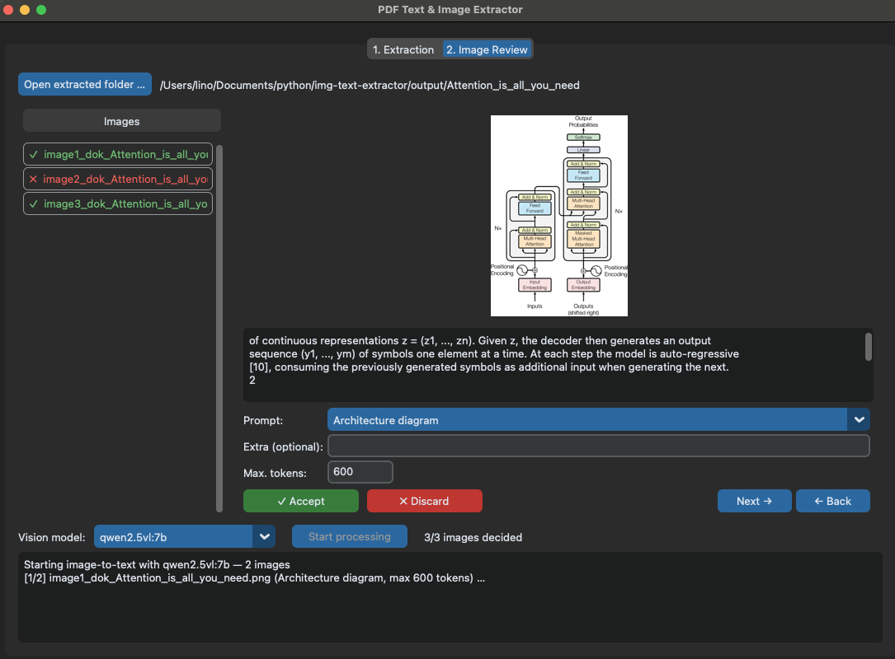

# PDF Text & Image Extractor

Turns a PDF into a single plain-text file in which the figures have become
text. OCR reads the pages, so scanned documents work like born-digital ones;
embedded images are extracted and marked at their position, and a local vision
model writes each image's content back into the document in place.

You decide per image: discard it, or assign one of ten extraction prompts — a
chart becomes a list of values, a table becomes Markdown, a formula becomes
LaTeX. Nothing leaves the machine.



A figure in the extracted text starts as a marker. Accepting it with a prompt
replaces that marker in place, wrapped so a downstream parser can find the
boundary between document text and model text again:

```text
[image1_dok_quarterly-report]
```

```text
[extraction_method: Chart and diagram]
Bar chart. Title: Revenue (M EUR). X-axis: Quarter (Q1, Q2, Q3, Q4). Y-axis: Revenue (M EUR). Data series: Revenue per quarter. Values: Q1: 24 M EUR, Q2: 38 M EUR, Q3: 31 M EUR, Q4: 47 M EUR. Trend: Revenue increased from Q1 to Q4.
[/extraction_method]
```

## Quickstart

Needs Python 3.11 or 3.12.

```bash
# 1. install
python3 -m venv .venv
.venv/bin/pip install -r requirements.txt

# 2. vision backend for the image step
ollama serve                    # https://ollama.com
ollama pull qwen2.5vl:7b        # ~6 GB, runs within 24 GB RAM

# 3. extract a PDF, then review its images
.venv/bin/python gui.py
```

On the first extraction PaddleOCR downloads its own OCR models, which takes a
minute or two once. Ollama is only needed for the image step — extraction and
review work without it.

## Commands

```bash
.venv/bin/python gui.py                       # extract, review, describe

.venv/bin/python extract.py report.pdf        # extraction only, no GUI
.venv/bin/python extract.py report.pdf -o results --lang en
```

`extract.py` takes `-o/--output` and `--lang`; both are listed with their
defaults in [docs/configuration.md](docs/configuration.md).

## Every image is a decision

The extractor never guesses which figures matter. It marks all of them and
hands the choice to you, because a decorative logo and a diagram carrying the
argument look identical to a layout parser:

| Decision | What happens to the marker |
|----------|----------------------------|
| Discard | Removed from the `.txt` immediately |
| Accept + prompt | Replaced by the model's text, wrapped in `[extraction_method: <prompt>]` … `[/extraction_method]` |

Decisions persist in `review_state.json`, so a long document can be reviewed
across several sittings. The walkthrough is in [docs/gui.md](docs/gui.md), the
prompt library in [docs/prompts.md](docs/prompts.md).

## Output

Each PDF produces a folder named after the document:

```
output/<docname>/
├── <docname>.txt         full text in reading order, images as [imageN_dok_<docname>]
├── <docname>_final.txt   after review: markers replaced by the model's text
├── review_state.json     per-image decisions, lets a review be resumed
├── annotated_pages/      page renders with boxes drawn — blue kept, grey dropped, red image
└── images/               embedded images in original quality
```

The source `.txt` is never overwritten by a review run, so the same extraction
can be reviewed again with different prompts.

## Documentation

| Document | Contents |
|----------|----------|
| [docs/extraction.md](docs/extraction.md) | Pipeline steps, the image-internal text filter, reading order, limitations |
| [docs/gui.md](docs/gui.md) | Both tabs, the review loop, how processing runs |
| [docs/prompts.md](docs/prompts.md) | The ten prompts, adding your own, output length |
| [docs/configuration.md](docs/configuration.md) | Every constant and CLI flag with its default |

## Project structure

| Path | Purpose |
|------|---------|
| `extract.py` | CLI and extraction pipeline: render, OCR, image extraction, reading order |
| `gui.py` | CustomTkinter app: extraction tab, image review, vision-model run |
| `img-extraction-prompts/` | Prompt library, one `.txt` per prompt |
| `requirements.txt` | Pinned direct dependencies |

## License

MIT — see [LICENSE](LICENSE).
